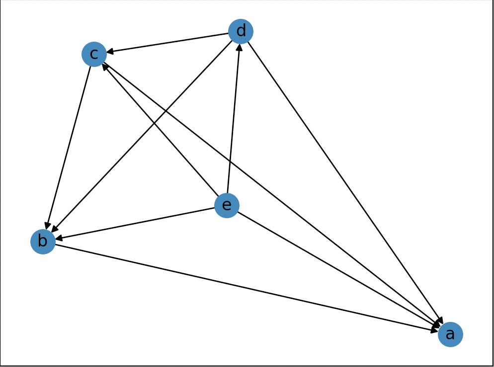

# Dependence

Accepts a series of assignment statements, generates and visualizes the dependency between the variables from the code. This is a personal learning tool to understand how the "greying out variables" feature in many IDEs like VSCode or Atom works.



## Requirements and Setup
- Python 3.8+
- `matplotlib==3.4.1`
- `networkx==2.5.1`

To setup to run this project, create a virtual environment and install the dependencies:
```
% python3 -m venv env
% env/bin/pip install -r requirements.txt
% source env/bin/activate
```
This should set up a virtual environment in which you can run your project.

## Usage
The program can be invoked as follows:
```
% python3 main.py [path/to/file]
```
This should return on the command line a list of directed edges as generated by parsing the program, and a new window with the graph visualised.

### Input Format
The file taken as input requires very specific formatting. Currently, `dependence` can only handle the visualization of simple assignment statements. Thus, it accepts a block of assignment statements, formatted as follows:
```
a = 3;
b = 2 + a;
c = a + b;
d = c - 1;
```
**Note that all assignment statements except the last one must be terminated by a semi-colon.** Also note that assignments can be simple value assignments or binary operations.

### Contributing
This project is open to contributions! There is lots still to be done — to name a few tasks:
- adopting the grammars of popular languages rather than developing our own, to make the tool more usable
- support for functions, function call, and scopes
- support for project-wide analysis, rather than single-file

If you're interested in helping out, feel free to start a PR!